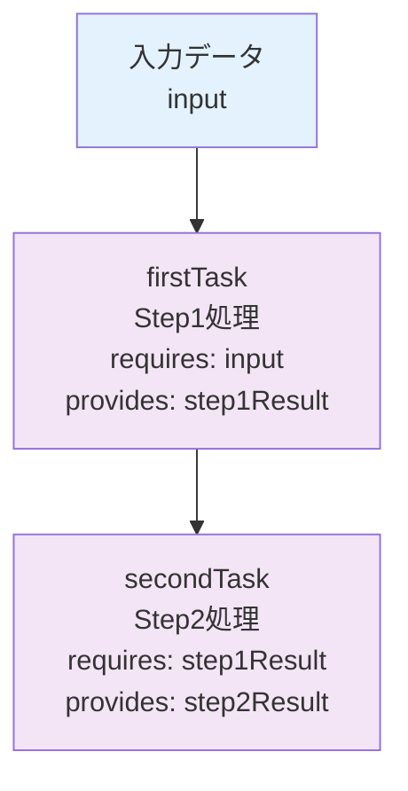
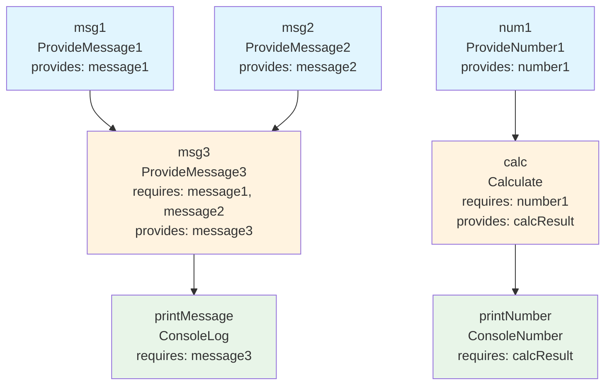

# Flowed フロー依存関係分析

## 概要

Flowedフレームワークを使用したTypeScriptアプリケーションの各エンドポイントのフロー依存関係を分析し、実行順序を図示化します。

## エンドポイント一覧

### 1. `/api/mvp` - 最小構成テスト
2段階の順次処理フローでFlowedの基本動作を確認

### 2. `/api/multi-task` - 並行処理デモ
複雑な依存関係を持つ並行処理フローで実際のワークフローを実装

### 3. `/api/basic` - 基本動作テスト
組み込みリゾルバー（Noop）を使用した最小テスト

## 1. MVPエンドポイント (`/api/mvp`)

### 目的
Flowedの基本的な依存関係制御を確認する最小構成のテスト

### フロー構成
```
input → firstTask (step1) → secondTask (step2) → step2Result
```

### タスク定義
- **firstTask**: 入力を受け取り、`step1Result`を生成
- **secondTask**: `step1Result`を受け取り、`step2Result`を生成

### 依存関係図


### リゾルバー実装
```typescript
step1: (params) => ({ step1Result: `Step1処理完了: ${params.input}` })
step2: (params) => ({ step2Result: `Step2処理完了: ${params.step1Result} -> 変換済み` })
```

## 2. Multi-Taskエンドポイント (`/api/multi-task`)

### 目的
複雑な依存関係を持つ並行処理の実装とデモンストレーション

### フロー構成
2つの独立した処理パイプライン：
1. **メッセージ処理パイプライン**: msg1, msg2 → msg3 → printMessage
2. **数値計算パイプライン**: num1 → calc → printNumber

### タスク定義

#### メッセージ処理系
- **msg1**: `message1`を生成（並行実行）
- **msg2**: `message2`を生成（並行実行）
- **msg3**: `message1`と`message2`を組み合わせて`message3`を生成（依存関係あり）
- **printMessage**: `message3`をコンソール出力

#### 数値計算系
- **num1**: `number1`を生成（並行実行）
- **calc**: `number1`を使って計算し`calcResult`を生成
- **printNumber**: `calcResult`をコンソール出力

### 依存関係図


### 実行フェーズ

#### フェーズ1: 並行実行（依存関係なし）
```
[msg1] [msg2] [num1]  ← 同時実行
  ↓      ↓      ↓
message1 message2 number1
```

#### フェーズ2: 依存処理（第1段階）
```
[msg3]           [calc]  ← msg1,msg2完了後 | num1完了後
  ↓               ↓
message3        calcResult
```

#### フェーズ3: 出力処理（第2段階）
```
[printMessage]  [printNumber]  ← msg3完了後 | calc完了後
```

### リゾルバークラスの詳細

| クラス | 役割 | 入力 | 出力 | 処理内容 |
|--------|------|------|------|----------|
| `ProvideMessage1` | メッセージ1生成 | なし | `message1` | `"Message1 number 1"` |
| `ProvideMessage2` | メッセージ2生成 | なし | `message2` | `"Message2 number 1"` |
| `ProvideMessage3` | メッセージ統合 | `message1`, `message2` | `message3` | 2つのメッセージを組み合わせ |
| `ProvideNumber1` | 数値生成 | なし | `number1` | `1` |
| `Calculate` | 数値計算 | `number1` | `calcResult` | `number1 + 2 * 12` |
| `ConsoleLog` | テキスト出力 | `text` | `result` | コンソールにテキスト出力 |
| `ConsoleNumber` | 数値出力 | `number` | `result` | コンソールに数値出力 |

### 実際の実行例
```
入力: {"test": "dependency test"}

フェーズ1実行結果:
- message1: "Message1 number 1"
- message2: "Message2 number 1"  
- number1: 1

フェーズ2実行結果:
- message3: "Combined: Message1 number 1 + Message2 number 1 = Message3 number 1"
- calcResult: 25 (1 + 2 * 12)

フェーズ3実行結果:
- printMessage: コンソール出力
- printNumber: コンソール出力
```

## 3. Basicエンドポイント (`/api/basic`)

### 目的
Flowedの組み込みリゾルバーを使用した最小テスト

### フロー構成
```
task1 (flowed::Noop) → myResult
```

## フロー設計の特徴

### 1. 並行処理の最適化
- 依存関係のないタスクは自動的に並行実行
- CPUとI/Oリソースの効率的な活用

### 2. 型安全な依存関係管理
- `requires`と`provides`による明示的な依存関係定義
- TypeScriptによるコンパイル時型チェック

### 3. 段階的な処理フロー
- **フェーズ1**: データ生成（並行）
- **フェーズ2**: データ処理（依存関係あり）
- **フェーズ3**: 結果出力（依存関係あり）

### 4. エラーハンドリング
- タスクレベルでのエラー分離
- 部分的な失敗に対する柔軟な対応

## 実装のポイント

### 1. リゾルバーの戻り値とresultsマッピング
```typescript
// Calculateクラスの戻り値
return { calcResult: result };

// フロー定義のresultsマッピング
results: { calcResult: "calcResult" }
```

### 2. パラメータマッピング
```typescript
// 正しいパラメータマッピング
params: { number1: "number1" }  // ✓
params: { number1: "${number1}" }  // ✗ (文字列テンプレートは不要)
```

### 3. 依存関係の指定
```typescript
requires: ["message1", "message2"]  // データキー名を指定
// タスク名ではなく、providesで定義されたデータキーを使用
```

## 利点と応用

### 1. 開発効率の向上
- 複雑な非同期処理を宣言的に記述
- ワークフローの可視化と理解の容易さ

### 2. パフォーマンス最適化
- 自動並行実行による処理時間の短縮
- 依存関係の最適化

### 3. 保守性
- ワークフローの変更が容易
- タスクの追加・削除が簡単

### 4. スケーラビリティ
- 大規模システムでの協調処理に対応
- マイクロサービス間の協調処理に適用可能

## 今後の拡張可能性

1. **条件分岐フロー**: 結果に応じた動的なタスク実行
2. **ループ処理**: 繰り返し処理の実装
3. **外部API連携**: HTTPリクエストを含むワークフロー
4. **エラーリカバリ**: 失敗時の代替処理フロー 

## Flowedの利点まとめ

1. **開発効率の向上**: 複雑な非同期処理を宣言的に記述
2. **パフォーマンス最適化**: 自動並行実行による処理時間の短縮
3. **保守性**: ワークフローの可視化と変更の容易さ
4. **信頼性**: 型安全性とエラーハンドリングの改善
5. **スケーラビリティ**: 大規模システムでの協調処理に対応

## 参考資料

- [Flowed公式ドキュメント](https://danielduarte.github.io/flowed/)
- [フロー依存関係分析](./flow-dependency-analysis.md)
- [Flowedリポジトリ](https://github.com/danielduarte/flowed) 